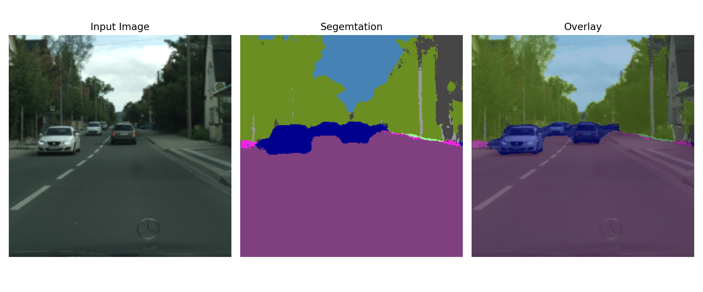
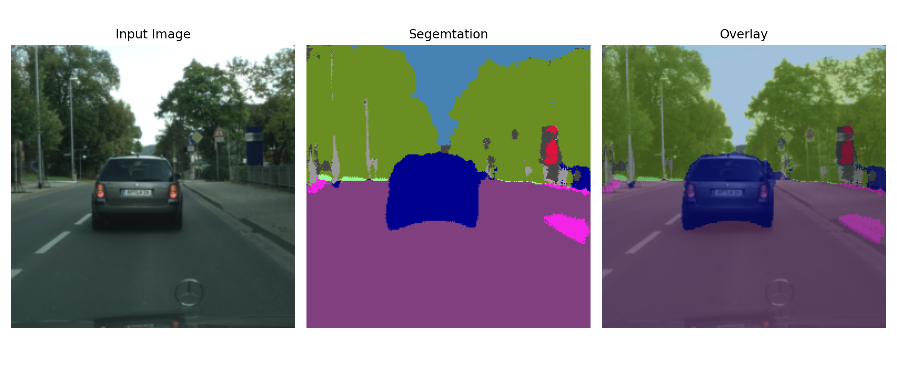
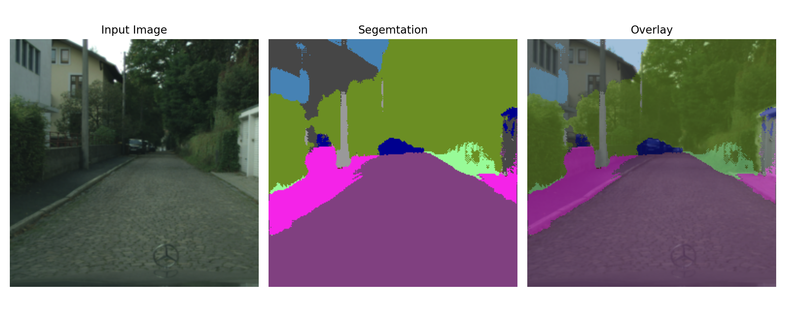

# Assignment 0

## Segmentation

### Task1: Data Augmentation

Please check the code in dataset.py

### Task2: Training

Training Process:


Visualize and test:


Test result: [Test] mIoU 0.2786

Examples of result:







## Discussion

1. The currently used cross-entropy loss is the built-in cross-entropy function from `torch.nn`, which does not exhibit issues with loss becoming NaN or gradient explosion during use.

2. When I implemented the cross-entropy loss using the following code, I encountered a NaN loss at the 6th epoch.

   ```python
   def cross_entropy_loss(prediction: torch.Tensor, labels: torch.Tensor, ignore_index=255):
       # Ensure labels are on the same device as the prediction
       labels = labels.to(prediction.device)
       # Apply softmax to obtain probabilities
       probs = F.softmax(prediction, dim=1)  # [B, C, H, W]
       # Create a mask to ignore the specified index
       mask = (labels != ignore_index)  # [B, H, W]
       # Reshape mask to match the shape of probabilities
       mask = mask.unsqueeze(1)  # [B, 1, H, W]
       # Create one-hot encoding of labels
       labels_one_hot = torch.zeros_like(probs)  # [B, C, H, W]
       # Only scatter valid labels, ignore the ignore_index
       valid_labels = labels.clone()
       valid_labels[valid_labels == ignore_index] = 0  # Replace ignore_index with a valid index (e.g. 0)
       labels_one_hot.scatter_(1, valid_labels.unsqueeze(1), 1)  # One-hot encoding of labels
       # Calculate the loss only for valid pixels
       loss = -torch.sum(mask * (labels_one_hot * torch.log(probs + 1e-10))) / mask.sum()
       return loss
   ```

3. After trying various methods to apply gradient clipping in the training loop, I still encountered a NaN loss at the 10th epoch.

   ```python
   # learning rate setting
   optimizer = torch.optim.Adam(model.parameters(), lr=1e-4)  # 尝试较小的学习率
   
   # adopt clipping in training epoch
   for epoch in range(num_epochs):
       for data, labels in dataloader:
           optimizer.zero_grad()
           outputs = model(data)
           loss = F.cross_entropy(outputs, labels, ignore_index=ignore_index)
           
           loss.backward()
           
           # clipping
           torch.nn.utils.clip_grad_norm_(model.parameters(), max_norm=1.0)
           
           optimizer.step()
   ```

It is suspected that the built-in cross-entropy loss function has some built-in optimizations to handle gradient explosion and NaN losses.