# Assignment 1
## Files format
See file_structure.txt file.

## Requeirements
See requirements.txt file.

## Command
```
python3 python/mainBaseline.py
```

## 1.2.1 Least Squares-Based Method
### Least Squares Method
**Equation:**
𝐼 = 𝐿 ⋅ 𝑁
Where:
𝐼 is the intensity matrix.
𝐿 is the light direction matrix.
𝑁 is the normal vector matrix.
The algorithm collects pixel intensities and uses NumPy’s lstsq to estimate surface normals.

**Algorithm Workflow**
1. Obtain Intensity Matrix: Collect pixel intensity values from the input images based on the binary mask.

2. Light Direction Matrix: Prepare the matrix of light source directions.

3. Solve for Normals using Least Squares: Apply the Least Squares method to estimate the normal vectors from the intensity and light direction matrices.

4. Construct Normal Map: Build the normal map using the estimated normal vectors.

5. Normalize Normals: Normalize the normal map to ensure all normal vectors have unit length.

The results folder for the output:
- normal_map.png: The estimated normal map saved as a PNG image.
- normal_map.npy: The estimated normal map saved as a NumPy array.

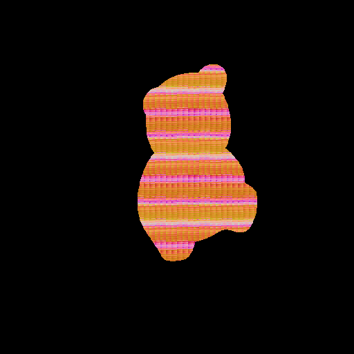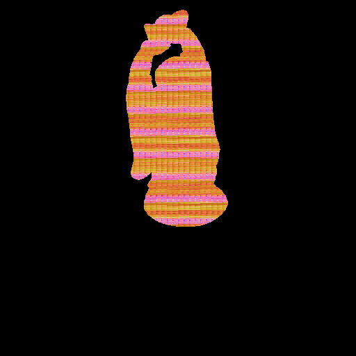
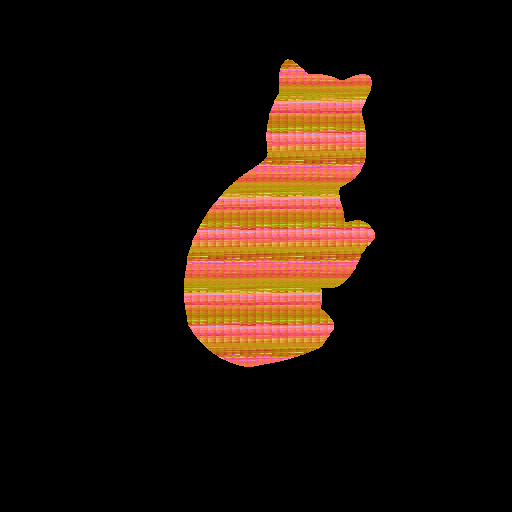
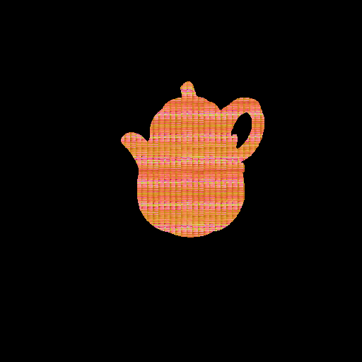


### Estimation of normal:

**Dealing with shadows and highlights:**

**Workflow**
1. Image Resizing: If specified, images are resized to the given dimensions.

2. Mask Application: Only valid pixels, indicated by the mask, are processed.

3. Intensity Matrix Formation: The intensity values for valid pixels across all images are collected.

4. Discard Outliers: The darkest and brightest pixel values are discarded based on the specified percentage.

5. Least Squares Normal Estimation: The normal vectors are estimated using the least squares method on the filtered intensity data.

6. Normal Map Construction: A normal map is constructed from the estimated normals.

7. Normalization: The normal map is normalized to ensure all vectors have unit length.

8. Result Saving: The normal map is saved as both a PNG image and a NumPy array in a designated results folder.

**Results**

- normal_map_robust.png: The estimated normal map saved as a PNG image.
- normal_map_robust.npy: The estimated normal map saved as a NumPy array.


## 1.2.2 Low-rank Factorization (PCA)

**Workflow**
1. Image Resizing: Images are reshaped according to the specified dimensions, if provided.

2. Mask Application: Only pixels where the mask is non-zero are considered for normal estimation.

3. Intensity Matrix Formation: The intensity values for valid pixels across all images are collected into a matrix.

4. Normal Vector Estimation:

- The algorithm first attempts to solve for normals using the pseudo-inverse of the light direction matrix.
- If the direct method encounters a numerical issue, it falls back to the least squares solution.
5. Normal Map Construction: A normal map is constructed from the estimated normal vectors.

6. Normalization: The normal map is normalized to ensure all vectors have unit length.

7. Result Saving: The normal map is saved as both a PNG image and a NumPy array in a designated results folder.

**Results**

- normal_map_pca.png: The estimated normal map saved as a PNG image.
- normal_map_pca.npy: The estimated normal map saved as a NumPy array.

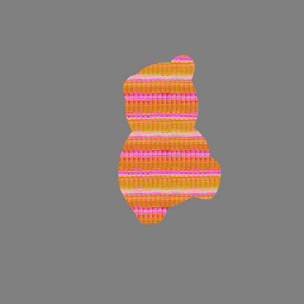
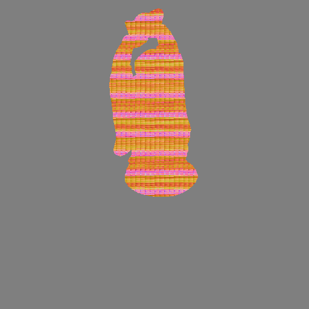
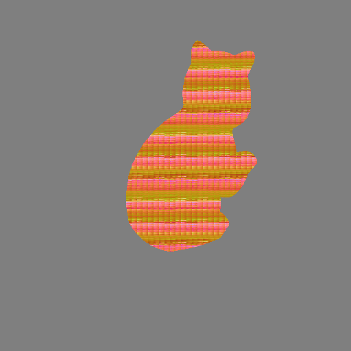
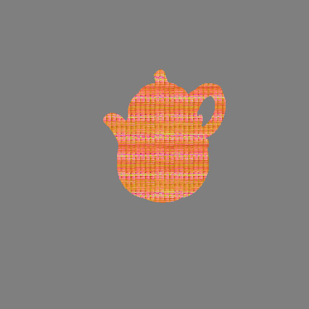


## 1.2.3 From normal to mesh

**Workflow**
1. Normal Map Validation: The normal map is cleaned to replace any invalid values, ensuring that areas outside the mask are set to a default upward normal vector.

2. Surface Gradient Calculation: The surface gradients 𝑝 and 𝑞 are extracted from the normal vectors.

3. Depth Map Reconstruction: The Frankot-Chellappa algorithm is applied to integrate the gradients and produce a depth map.

4. Mesh Generation:

- A point cloud is created from the depth map, ensuring that only valid points are included.
- Several methods, including Poisson reconstruction and ball pivoting, are attempted to generate a mesh from the point cloud. If these fail, a convex hull is created as a fallback.
5. Result Saving: The depth map and mesh are saved in a designated results folder.

**Results**

- normal_map_pms.png
- normal_map_pms.npy

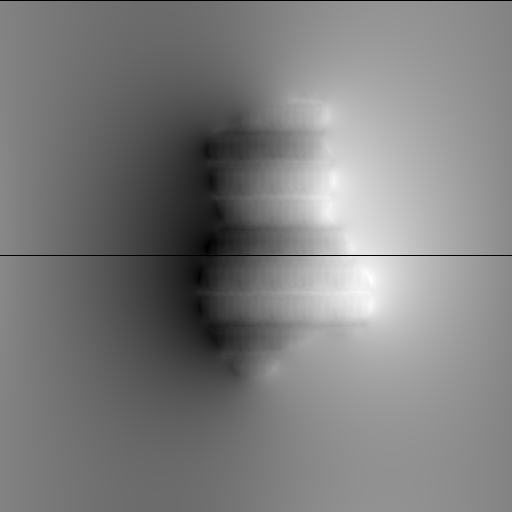
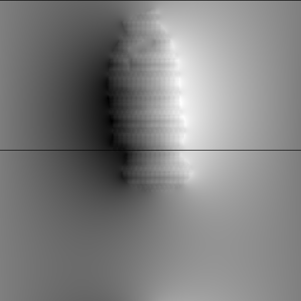
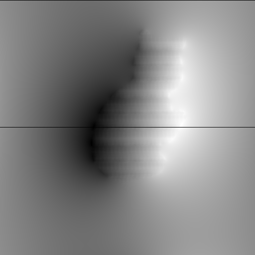
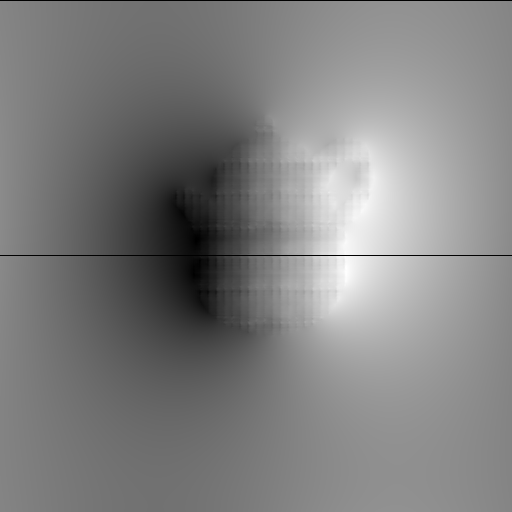

