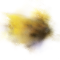
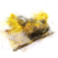
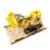
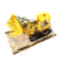
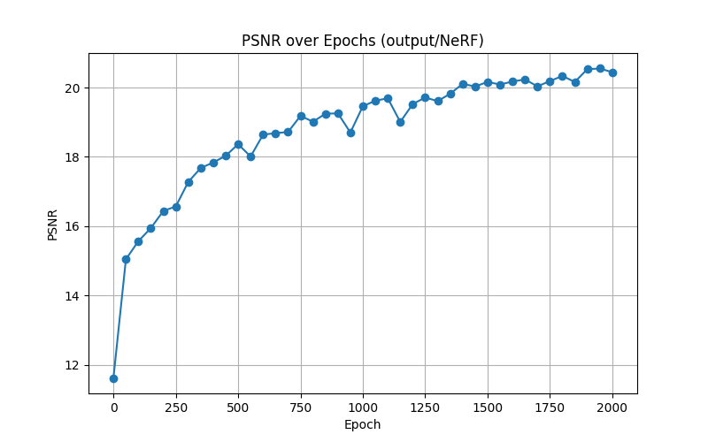
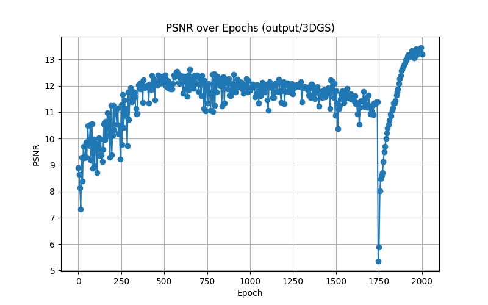

# ELEC5630 – Assignment 4

## Neural Rendering: NeRF & 3D Gaussian Splatting

**Author:** Liu Yu
**Student ID:** 21229843
---


# 2. Environment Setup

A Python virtual environment was used for all experiments.

## 2.1 Installing the Environment

```bash
pip install -r requirements.txt
```

## 2.2 Additional Dependency: simple-knn

Gaussian Splatting requires the CUDA library **simple-knn**:

```bash
pip install git+https://github.com/camenduru/simple-knn
```

---

# 3. Methods

## 3.1 NeRF Implementation

NeRF is trained via differentiable volume rendering.
Completed components include:

* MLP predicting (density, RGB)
* Stratified ray sampling
* Volume rendering integration
* Training on the Lego dataset
* PSNR evaluation

Training script:

```
python3 train_3d_nerf.py
```

---

## 3.2 Gaussian Splatting Implementation

All required code was filled inside:

```
gaussian_splatting/gauss_render.py
```

### 3.2.1 Implemented Components

* `build_scaling_rotation(s, r)`

  * Convert quaternion → rotation matrix
  * Build scale matrix
  * Multiply to obtain `RS`

* `corvariance_3d(s, r)`

  * Compute 3D Gaussian covariance:

    ```
    Cov3D = (RS)(RS)^T
    ```

* `corvariance_2d(...)`

  * Project centers into camera space
  * Clip to FOV bounds
  * Compute projection Jacobian
  * Transform covariance into image space
  * Add EWQ low-pass filter

* Differentiable tile-based Gaussian splatting renderer

* Depth sorting and alpha compositing

### 3.2.2 Training Framework

Training script:

```
python3 train_gs.py
```

Two experimental modes:

1. **Random point cloud initialization**
2. **Lego PLY point cloud** (uncomment `fetchPly()` in the script)

---

# 4. Experiments

## 4.1 Dataset

The Lego dataset is used for both NeRF and Gaussian Splatting.

---

## 4.2 Experiment A: NeRF

### Training Command

```
python3 train_3d_nerf.py
```

### Results


* **Original image**


* **3d NeRF at epoch 100**



* **PSNR at epoch 100:** 15.57


* **Rendered image at epoch 500**


* **PSNR at epoch 500:** 18.37


* **Rendered image at epoch 1000**


* **PSNR at epoch 1000:** 19.46

* **Rendered image at epoch 1500**


* **PSNR at epoch 1500:** 20.16

* **Rendered image at epoch 2000**


* **PSNR at epoch 2000:** 20.44

**PSNR in different epochs:**



### Analysis

**1. Initial Stability:**

PSNR starts at around 12 and remains stable for the first 300 epochs, indicating minimal improvements at the beginning.

**2. Gradual Increase:**

From epoch 300 to 1800, PSNR steadily rises, indicating effective learning and refinement of image quality.

**3. Improvement Plateau:**

After 1800 epochs, PSNR approaches a plateau around 20, suggesting diminishing returns on additional training.

**4. Convergence:**

By 2000 epochs, the PSNR stabilizes near 20, indicating that the model has reached a satisfactory level of detail and quality.

---

## 4.3 Experiment B: Random Gaussian Initialization

### Training Command

```
python3 train_gs.py
```

### Results


* **Original image**


* **Epoch 100**


* **PSNR at epoch 100:** 10.41


* **Epoch 500**


* **PSNR at epoch 500:** 10.34


* **Epoch 1000**


* **PSNR at epoch 1000:** 11.02

* **Epoch 1500**


* **PSNR at epoch 1500:** 10.17

* **Epoch 2000**


* **PSNR at epoch 2000:** 11.74

**PSNR in different epochs:**


### Analysis

**1. Early Blurriness:**

PSNR is low in the first 300 epochs, indicating significant image blurriness.

**2. Gaussian Clustering:**

From epochs 300 to 1200, PSNR gradually rises as Gaussians cluster around object surfaces.

**3. Slow Improvement:**

The PSNR increase is gradual, showing that extensive training is needed for learning details.

**4. Convergence:**

After 1800 epochs, PSNR stabilizes between 10 and 12, highlighting the necessity for many epochs to achieve optimal results.

---

## 4.4 Experiment C: Gaussian Splatting with Lego Point Cloud

### Enable PLY Point Cloud

Uncomment in `train_gs.py` and enable ply:

```python
xyz, shs = fetchPly('data/lego/lego/fused_light.ply')
```

### Training Command

```
python3 train_gs.py
```

### Results


* **Epoch 100**


* **PSNR at epoch 100:** 9.85


* **Epoch 500**


* **PSNR at epoch 500:** 12.30


* **Epoch 1000**


* **PSNR at epoch 1000:** 11.82


* **Epoch 1500**


* **PSNR at epoch 1500:** 11.81


* **Epoch 2000**


* **PSNR at epoch 2000:** 13.20

**PSNR in different epochs:**



### Analysis


**1. Early Blurriness:**

At epoch 100, the PSNR is low (9.85), indicating significant image blurriness, which is typical at the beginning of training.

**2. Gaussian Clustering:**

Between epochs 100 and 500, PSNR rises to 12.30 as Gaussians begin clustering around object surfaces, improving the overall image quality.

**3. Fluctuating Improvement:**

After reaching 12.30, the PSNR experiences a drop, particularly noticeable at epoch 1750. This sudden decrease suggests instability in the model during this phase of training.

**4. Subsequent Recovery:**

Following the drop at epoch 1750, the PSNR shows a gradual recovery, peaking at 13.20 by epoch 2000. This indicates that, despite volatility, the model ultimately improves with continued training, highlighting the dynamic nature of the learning process and the necessity for patience in achieving optimal performance.
---

# 5. Results and Analysis

## 5.1 PSNR Comparison

The experiments revealed notable differences in PSNR values between NeRF and Gaussian Splatting:

* **NeRF vs. Random Gaussian Initialization**:
  - NeRF begins with a PSNR of around 12 and steadily reaches 20.44 by epoch 2000, indicating effective refinement over time.
  - Random Gaussian initialization peaks at 11.74, struggling to improve, suggesting difficulties in finding optimal configurations without structured input.

* **NeRF vs. Lego Point Cloud Initialization**:
  - The Lego point cloud shows a similar initial blur (PSNR of 9.85) but improves to 13.20, highlighting that structured inputs stabilize learning better than random ones.

### Summary

- Structured initializations (like Lego) lead to faster convergence and better performance due to stronger geometry priors.
- Random initializations hinder performance by requiring the model to learn both structure and texture simultaneously.
- NeRF benefits from capturing complex volumetric representations, achieving higher PSNR compared to Gaussian Splatting, especially in early epochs.

---

# 6. Discussion

### Why is the PLY Initialization Faster?

1. **Proximity to Surface Geometry**:
   - Gaussian centers are close to actual surfaces, allowing effective utilization of geometric knowledge.

2. **Stable Projection Jacobian**:
   - Well-positioned Gaussians lead to a smoother gradient flow during training, enhancing convergence speed.

3. **Adaptive Covariance Matrices**:
   - The initial setup allows covariance matrices to quickly adapt to scene geometry, simplifying modeling.

4. **SH Coefficients Convergence**:
   - Faster convergence of spherical harmonic coefficients is possible due to meaningful direction vectors from the start.

### Comparison with NeRF

* **Efficiency of Learning**:
  - Gaussian Splatting achieves higher PSNR values earlier, benefiting from explicit point cloud structure, unlike NeRF, which relies on volumetric integration that complicates learning.

* **Structured Learning vs. Volume Rendering**:
  - The explicit representation of Gaussian Splatting reduces ambiguity and allows the model to focus on optimizing color and opacity efficiently.

In summary, structured initialization enhances the learning process in Gaussian Splatting, leading to faster convergence and improved output quality compared to random initialization.

---
