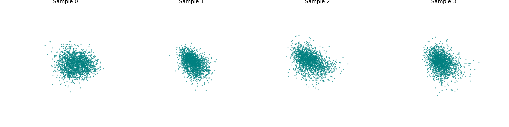

# ELEC5630 – Assignment 5

## 3D Generation: Point Cloud Diffusion Models

**Author:** LIU, Yu
**Student ID:** 21229843

---

# 1. Environment Setup

A Python virtual environment is recommended for running the experiments.

## 1.1 Dependencies

The project relies on standard PyTorch and visualization libraries. Install them via:

```bash
pip install torch numpy matplotlib tqdm
```


# 2. Methods

This project implements a Denoising Diffusion Probabilistic Model (DDPM) for generating 3D point clouds1111. The implementation is divided into four core components.

## 2.1 Point Cloud Encoding Network (PointNet)

The noise prediction network ``\epsilon_\theta(x_t, t)`` is designed to be permutation invariant since point clouds are unordered sets.

Implemented Components:


- Time Embedding: Sinusoidal positional embeddings project the time step ``t`` into a high-dimensional vector.


- Local Feature Extraction: Shared MLPs (implemented via Conv1d) extract per-point features.


- Global Feature Aggregation: Max Pooling is applied to aggregate features across all points, capturing the global shape context5.


- Feature Concatenation: Local features, global features, and time embeddings are concatenated and passed through output MLPs to predict noise per point.

## 2.2 Forward Diffusion Process

The forward process gradually destroys data structure by adding Gaussian noise according to a fixed schedule.


- Noise Schedule: A Linear Beta Schedule is implemented, linearly increasing ``\beta_t`` from ``10^{-4}`` to ``0.02`` over ``T=1000`` steps8.


- Reparameterization Trick: Implemented the closed-form sampling to obtain ``x_t`` at any timestep directly from ``x_0``: 
    ```math
    x_t = \sqrt{\bar{\alpha}_t}x_0 + \sqrt{1 - \bar{\alpha}_t}\epsilon
    ```


## 2.3 Reverse Process & Training

The model learns to reverse the diffusion process10.


- Training Objective: Simplified MSE Loss between the actual noise ``\epsilon`` and the model's predicted noise ``\epsilon_\theta(x_t, t)``.


- Reverse Sampling: Implemented the iterative denoising step to estimate ``x_{t-1}`` from ``x_t``.

## 2.4 Evaluation & Visualization

To assess the quality of generated shapes:


- Chamfer Distance (CD): Measures the geometric similarity between two point clouds by finding the nearest neighbors for each point.


- Minimum Matching Distance (MMD): Evaluates the distribution quality by calculating the average minimum CD between the reference set (Ground Truth) and the generated set.


- Visualization: 3D scatter plots using Matplotlib to visualize the generated point clouds and the denoising trajectory.

# 3. Experiments

## 3.1 Dataset & Configuration

- Dataset: ShapeNet (Subset, 03001627).

- Resolution: 2048 points per shape.

- Hyperparameters:

    - Diffusion Steps (``T``): 1000

    - Batch Size: 32

    - Learning Rate: ``1e^{-4}``

    - Epochs: 50

## 3.2 Execution

To run the full training pipeline, generation, and evaluation, execute the provided shell script17:

```Bash
bash run.sh
```

This script handles directory creation, training, and result saving.

# 4. Results

## 4.1 Training Convergence

The model was trained using the MSE loss on the predicted noise.

- Training Loss Curve:


**Analysis:**

- Rapid Descent: The loss decreases significantly from ~1.15 to ~0.70 within the first 10 epochs, indicating the model quickly learns the coarse geometric features.

- Stabilization: After epoch 30, the loss stabilizes around 0.35 - 0.40. Fluctuations are observed (typical in stochastic training), but the overall trend shows convergence.

## 4.2 Denoising Process Visualization

We visualize the reverse diffusion process, starting from pure Gaussian noise (``x_T``) to the generated shape (``x_0``).

- Denoising Steps (From Noise to Shape):


Analysis:

- Early Stage (Left): The points are widely scattered, representing the initial Gaussian noise distribution.

- Intermediate Stage: Points begin to aggregate towards the center, forming a rough density cloud.

- Final Stage (Right): The points settle into a structured form, exhibiting the density characteristics of the target object class.

## 4.3 Final Generated Samples

Below are samples generated by the trained model using random noise as input.

- Generated Point Clouds:




Analysis:

- The model successfully generates coherent 3D structures from random noise.

- The generated point clouds show distinct clusters and shapes, demonstrating that the network has learned the underlying distribution of the training data.

- While the general shape is captured, some outlier points remain, which is characteristic of basic PointNet-based diffusion models.

# 5. Discussion

## 5.1 Effectiveness of PointNet in Diffusion

Using PointNet as the backbone for the noise predictor ``\epsilon_\theta`` proved effective. The Max Pooling operation is critical; it allows the network to aggregate global context (the overall shape being formed) and distribute this information back to individual points via concatenation. This ensures that points don't just move locally but coordinate to form a coherent global shape.

## 5.2 Challenges and Future Work

- Sampling Speed: The current linear schedule requires 1000 steps for generation, which is computationally expensive. Future work could implement acceleration techniques like DDIM.

- Fine Details: While the global shape is captured, the surface reconstruction could be smoother. Increasing the number of points or using a hierarchical network (like PointNet++) could improve detail resolution.