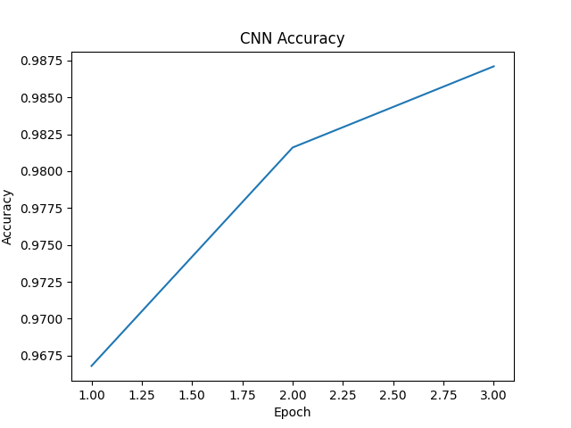
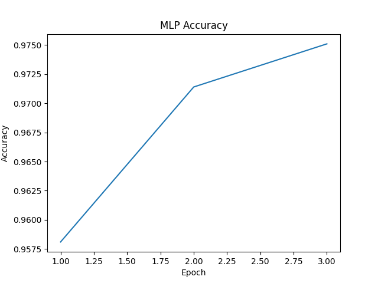
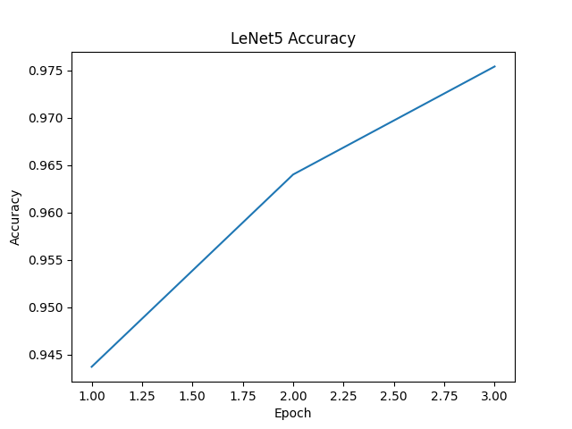

# Assignment 0

## Classification

###  Task 0: Visualization and Preprocess

(1) Randomly pick some samples and view individual images and corresponding labels from the dataset; 

(2) Analyze the distribution of digits in the dataset; 

(3) Generate statistical summaries of the dataset.

| Digit | Count | Mean Pixel Value    | Std Pixel Value     |
| ----- | ----- | ------------------- | ------------------- |
| 0     | 5923  | 0.17339931428432465 | 0.3477179706096649  |
| 1     | 6742  | 0.07599864900112152 | 0.24428154528141022 |
| 2     | 5958  | 0.14897511899471283 | 0.32592350244522095 |
| 3     | 6131  | 0.1415301412343979  | 0.317918598651886   |
| 4     | 5842  | 0.12136560678482056 | 0.29748430848121643 |
| 5     | 5421  | 0.12874938547611237 | 0.30358853936195374 |
| 6     | 5918  | 0.13730177283287048 | 0.3148975074291229  |
| 7     | 6265  | 0.11452770978212357 | 0.29169583320617676 |
| 8     | 5851  | 0.15015597641468048 | 0.3252599835395813  |
| 9     | 5949  | 0.12258995324373245 | 0.2986375689506531  |

### Task 1: Finish Different Types of Neural Networks

Accuracy:

CNN Accuracy:

MLP Accuarcy:

LeNet5 Accuracy:

Screenshot of your Python program:

